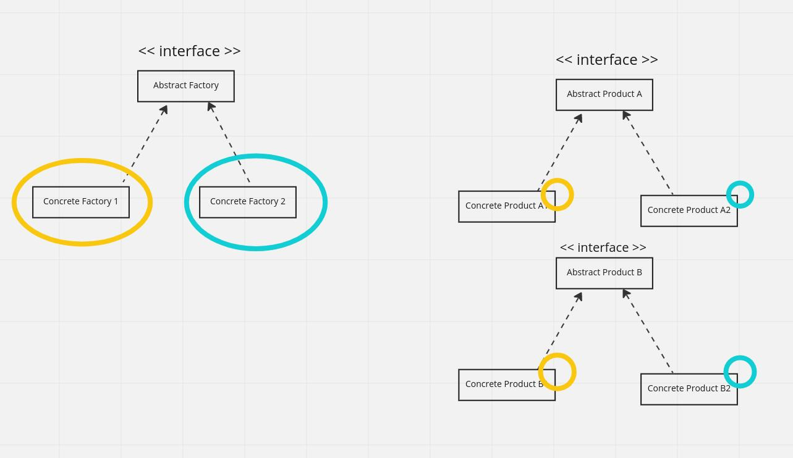
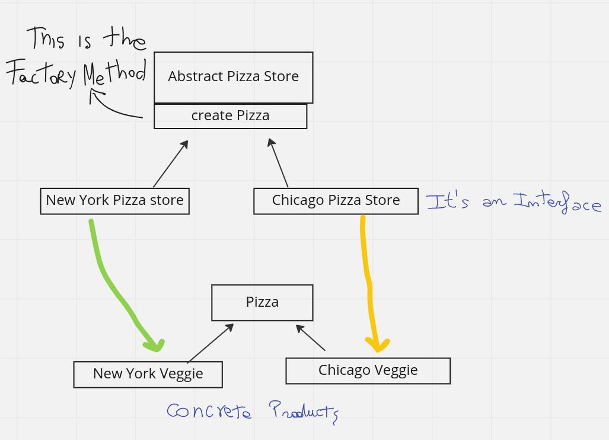

# Abstract Factory

In the Abstract Factory we resolve the problem of creating
a whole family of classes without specifying
their concrete classes.
It is also called "Factory of factories"

We use the operator "new" to create the objects, 
but we delegate to the factory.

The pattern is easy to recognize because it returns back
a Factory method.

A Factory Method encapsulate objects creation by letting subclasses decide what 
objects to create. It defines an interface for creating objects, but let the subclasses
decide which class to instantiate.
Moving the creation out into an object that only creates objects,
and then, a "client" class, just will use this factory.

An Abstract Factory provides an Interface for creating a family of products or related/dependent
objects without specifying their concrete classes.

**UML**

**Example 1**

