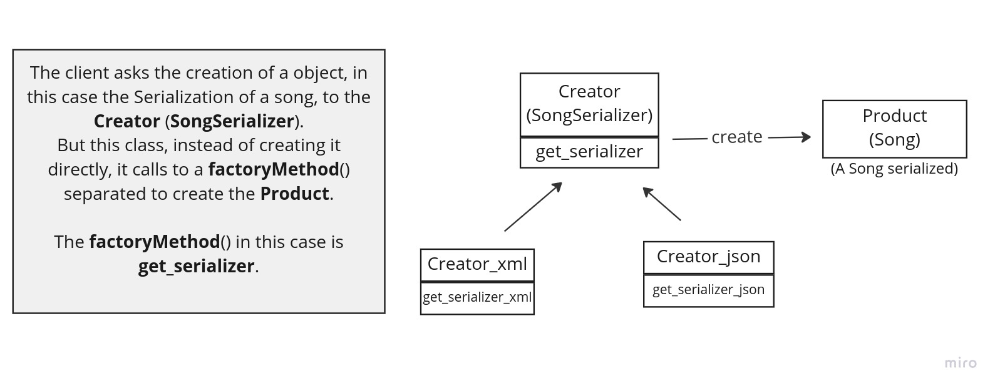

# **Factory Pattern**

This Pattern, in Python, is useful when the application needs to decide at run-time which class to use,
you are not sure of what type of object you'll be needed since it will be chosen during execution.

Take a look at the code in **FactoryPatternBegin**.py

The .serialize() method supports two different formats: JSON and XML.
Any other format specified is not supported, so a ValueError exception is raised.

(Value error on YAML)

This code is not maintainable and is not following the Single Responsibility pattern.

What if we introduce a new format ? We have to continuously add a new "if" in the code, 
the same applies if we remove a format.

When we start to refactoring a piece of code, we have to identify a common goal, 
and then, build a common interface.

Once found, the different implementation must be written, 
and this implementation is chosen based on some parameters.

## **Basic Implementation of Factory Method**

The central idea in Factory Method is to provide a separate component
with the responsibility to decide which concrete implementation
should be used based on some specified parameter. That parameter in our example is the format.
So in this first implementation we add a new method ._get_serializer() that takes the desired format.

In **FactoryPatternStage**.py the SongSerializer calls himself to get the correct implementation
of the serialization.

The last step is to move outside the get_serializer, deleting so the parameter "self" 

The mechanics of Factory Method are always the same. 
A client (SongSerializer.serialize()) 
depends on a concrete implementation of an interface. 
It requests the implementation from a creator component 
(get_serializer()) using some sort of identifier (format).

The creator returns the concrete implementation according to the value of the parameter to the client,
and the client uses the provided object to complete its task.

## When to use

Factory Method should be used in every situation where an application (client) depends
on an interface (product) to perform a task and there are multiple concrete implementations of that interface.
You need to provide a parameter that can identify the concrete implementation and use it in the creator 
to decide the concrete implementation.

- Replacing complex logical code: Complex logical structures in the format if/elif/else

- Constructing related objects from external data: Imagine an 
application that needs to retrieve employee information from a database or other external source.

Supporting multiple implementations of the same feature: The application can allow the user to select an option that identifies the concrete algorithm. 
Factory Method can provide the concrete implementation of the algorithm based on this option.

